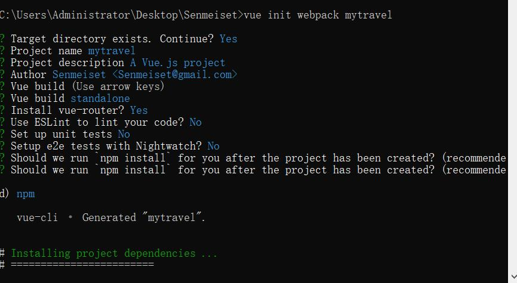

# mytravel

> A Vue.js project

## Build Setup

``` bash
# install dependencies
npm install

# serve with hot reload at localhost:8080
# 直接在项目目录下运行此段话，生成的上述链接就是文件目录下直接的根目录
npm run dev

# build for production with minification
npm run build

# build for production and view the bundle analyzer report
npm run build --report
```

For a detailed explanation on how things work,
 check out the [guide](http://vuejs-templates.github.io/webpack/) 
 and [docs for vue-loader](http://vuejs.github.io/vue-loader).


## Vue 安装及环境生成配置



``` bash
# 配置环境  如node ， cnpm ，安装webpack，webpack-cli
sudo npm install webpack -g
npm install webpack webpack-cli -g

# 安装vue 安装vue-cli
npm install vue -g

npm install -g vue-cli
sudo cnpm install -g vue-cli


# vue cli webpack this is mytravel
# 安装vue 环境搭建自动化脚手架项目
vue init webpack mytravel 

Target directory exists. Continue?    Y

Project name      [ent]

Project description   [项目说明]

Author         [项目维护人员]

Vue build  			[项目编译模式]  Use arrow keys

Vue build 			[包编译模式]		standlone

Install vue-router?   [项目是否安装vue路由模式]  Y

Use ESLint to lint your Code?  [是否安装ESLint检测你的代码格式] N

Set up unit tests      N

Setup e2e tests with Nightwatch? N

Should we run     [基于那种包管理模式下]  npm install

npm install fastclick --save    [解决移动端300毫秒点击延迟的问题，全局安装，不论是在编译环境还是打包环境，都依赖此包] 


npm install vue-awesome-swiper --save   【安装awesome-swiper插件】


[安装sass]
cnpm install node-sass --save-dev    

cnpm install sass-loader --save-dev

npm install vue-awesome-swiper --save


npm install better-scroll --save				【安装better-scroll插件】

npm install vuex --save				[安装vuex]


```


## 如环境更换则需要在新环境内安装该项目需要的插件及包依赖

``` bash

所需安装依赖请查看根目录下的package.json文件内容


其中： ‘dependencies’配置项必须全部存在


```


### Vue Router
``` bash
vue-router

【编程式跳转】
// 字符串
this.$router.push("/")

// 对象
this.$router.push({ path: 'home' })

// 带查询参数，变成 /register?plan=private
this.$router.push({ path: 'register', query: { plan: 'private' }})


【创建a标签来定义导航链接】
<router-link to="/city">	</router-link>


```